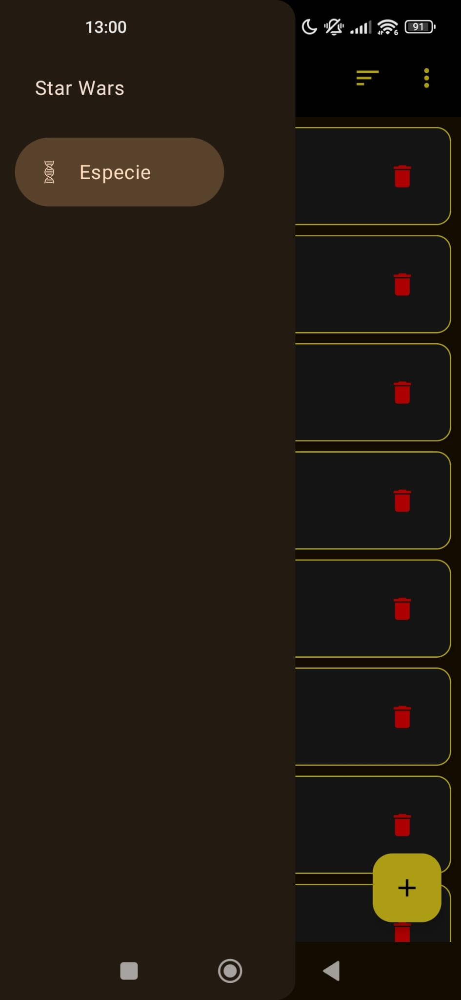
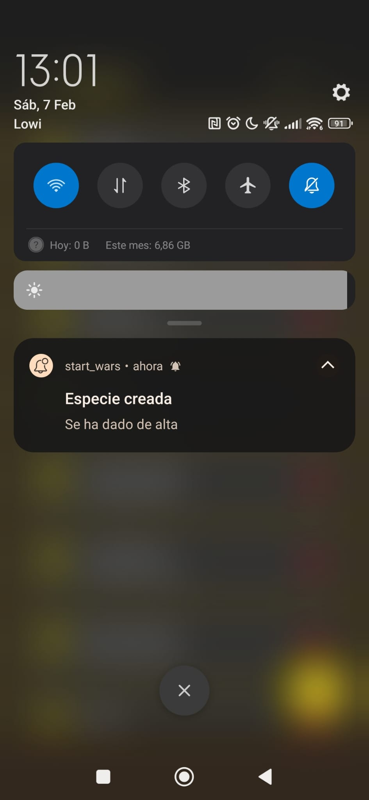

# Star Wars Wiki - Gestión de Especies

Aplicación Android nativa desarrollada en **Kotlin** con **Jetpack Compose**. Esta app implementa una arquitectura **MVVM** con **Clean Architecture**, inyección de dependencias mediante **Hilt** y persistencia de datos local con **Room Database**.

El proyecto permite la gestión completa (CRUD) de especies del universo Star Wars, incluyendo validaciones, notificaciones y navegación avanzada.

## 🚀 Funcionalidades Principales (Tarea 4)
* **Arquitectura Robusta:** MVVM + Repository Pattern + Clean Architecture.
* **Persistencia Local (Room):** Base de datos SQLite para almacenamiento offline.
* **Navegación Global:** Implementación de `Navigation Drawer` (Menú lateral) y `NavHost`.
* **CRUD Reactivo:**
    * Listado con actualización automática (`Flow`).
    * Alta, Baja y Modificación de especies.
* **Validaciones:** Control de duplicados (nombre único) con `AlertDialog` informativo.
* **Experiencia de Usuario:**
    * Filtrado y Ordenación (Ascendente/Descendente).
    * Animaciones en navegación y listas.
    * Feedback mediante `SnackBar` y Notificaciones del sistema.
* **Modo Oscuro:** Soporte nativo para Dark Mode.

## 🛠️ Stack Tecnológico
* **Lenguaje:** Kotlin
* **UI Toolkit:** Jetpack Compose (Material 3)
* **Inyección de Dependencias:** Dagger Hilt
* **Base de Datos:** Room (SQLite)
* **Concurrencia:** Coroutines & Flow
* **Navegación:** Navigation Compose

## 📸 Capturas de Pantalla
| Listado | Menú Drawer | Alta Especie |          Notificación          |
|:-------:|:-----------:|:------------:|:------------------------------:|
|  |  |  |  |

## 🔧 Guía de Instalación
1.  **Clonar el repositorio:**
    ```bash
    git clone [https://github.com/llamass06/StarWars-App.git]
    ```
2.  **Abrir en Android Studio:**
    * File > Open > Selecciona la carpeta `StartWars_TuApellido`.
3.  **Sincronizar:**
    * Deja que Gradle descargue las dependencias.
4.  **Ejecutar:**
    * Conecta tu dispositivo o inicia un emulador (Recomendado API 33+ para notificaciones).
    * Pulsa `Run` (Shift+F10).

## 👤 Autor
**[Álvaro Llamas Martín]**
* **Asignatura:** Desarrollo de Interfaces
* **Tarea:** 4 - Aplicación Multifuncional

---
